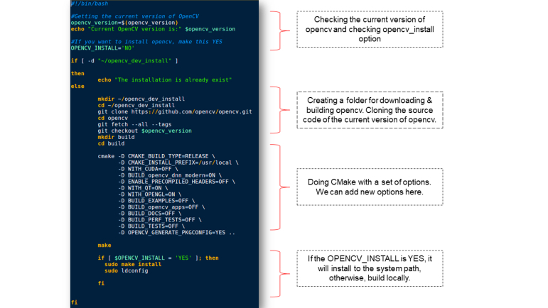
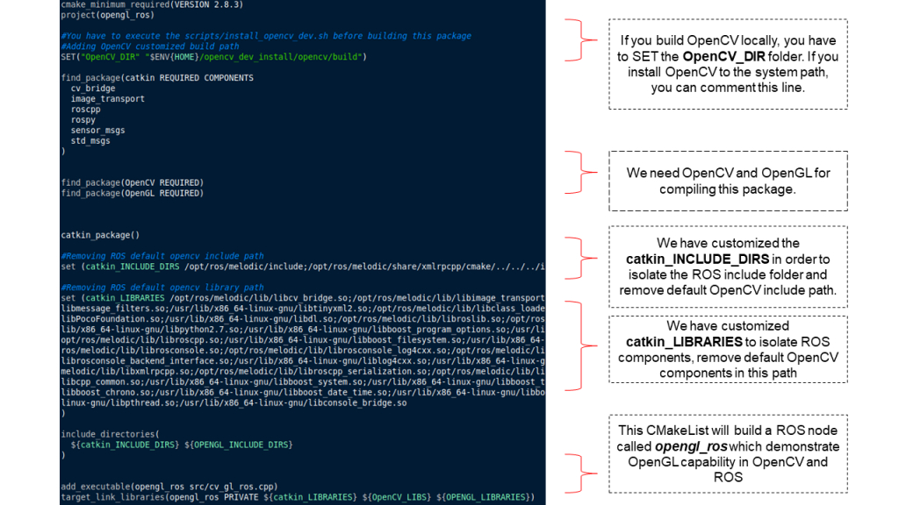
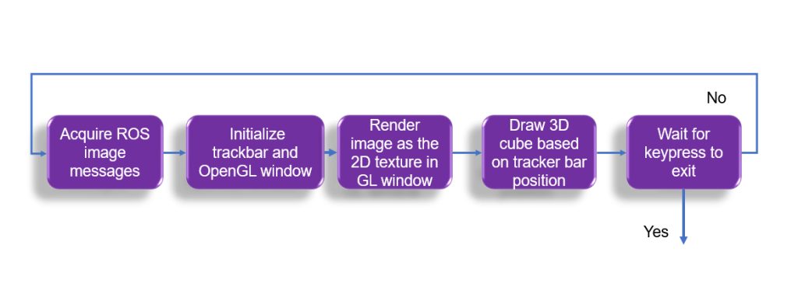
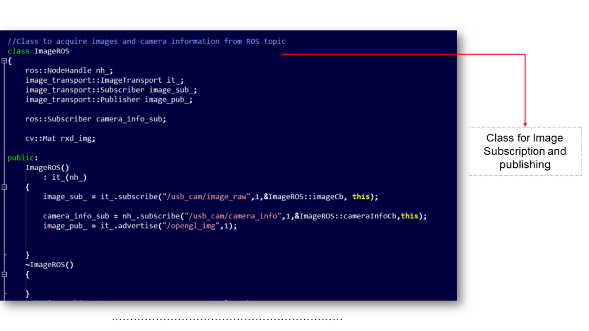
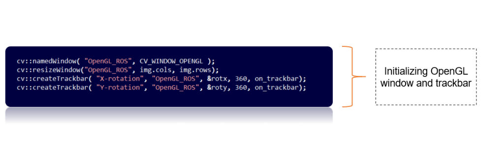
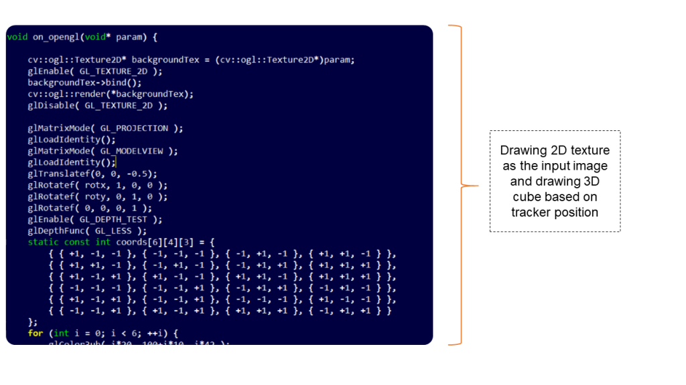
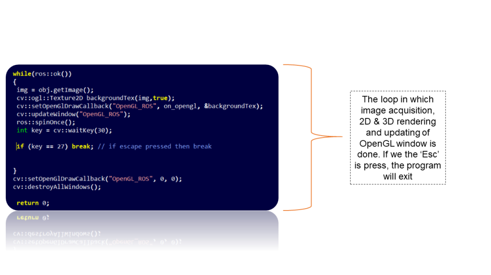

# Augmented Reality on ROS
**[Robotics](https://robocademy.com/category/robotics/), ROS Intermediate**
ar opencv ros, ar ros, augmented reality ros, opengl on ros, ros opencv opengl

## Table of Contents

1. Introduction
2. Integrating OpenGL in ROS
2.1 Compiling Customized OpenCV for ROS
2.2 Editing CMakeLists.txt
2.3 Testing OpenGL_ROS package
2.4 Code Explained
2.5 OpenCV-OpenGL interface
3. Summary
4. Reference

**Introduction**
If you are working on ROS and want to implement simple Augmented reality applications using [OpenGL](https://www.opengl.org/) and [OpenCV](https://opencv.org/), this post is for you. The AR applications may have the camera image on the background and drawing a 3D object on the top of the image. In this post, you can see how to draw a 3D object, say a 3D cube on the top of an image. You can apply your own algorithms to move the 3D object based on some object detection algorithms in OpenCV.

**Integrating OpenGL in ROS**
If you have ROS desktop full installation in your PC, you may have OpenCV installed along with the ROS installation. The OpenCV version comes along with ROS is not compiled with WITH_OPENGL=ON configuration. If it is not compiled with OpenGL, we can’t draw any 3D objects on the top of an OpenCV image.

In order to enable OpenGL on OpenCV which is installed along with ROS, you can use the following method.

**Compiling Customized OpenCV for ROS**
In order to enable OpenGL in OpenCV, you have to build OpenCV from source compilation.

**Note:** The OpenCV version of the source code should be the same as the installed opencv version. Otherwise, the OpenCV-ROS cv bridge will not work properly. In order to avoid ROS-OpenCV compatibility issues, we have to go for the same version of OpenCV. You can use the following script in order to do this task. You can either build opencv locally or you can install it on the system. The safest method is, installing locally and provide the path of opencv in CMakeLists.txt in order to build it from the local version.

You can clone the following [OpenGL_ROS](https://github.com/qboticslabs/opengl_ros) package to your catkin workspace in order to get started. The package is also having the shell script to install OpenCV.
```
cd /<path to your catkin_ws>/src/
git clone https://github.com/qboticslabs/opengl_ros
cd opengl_ros
gedit scripts/install_opencv.sh
```
Here is the [install_opencv.sh](https://github.com/qboticslabs/opengl_ros/blob/master/scripts/install_opencv.sh) script for installing customized OpenCV for ROS.


If you want to install customized OpenCV, first edit the configuration inside this script and save it. The main configuration parameters are

**OPENCV_INSTALL:** If it **'YES'**, it will build opencv and install into the system path. If **'NO'**, it will build locally.
_**Note:** I will refer you to stick with the local build of OpenCV first because it is safe to work with. Installing OpenCV may cause an undesired effect on your system._
**WITH_CUDA:** If you have NVIDIA GPU and if CUDA installed on your system, you can set the config as ‘ON’. This can accelerate the processing using GPU.
**WITH_OPENGL:** You have to put this configuration ON for compiling OpenCV with OpenGL.
To install the script you can simply follow the command below. Switch to opengl_ros folder and execute the following command

```./scripts/install_opencv.sh ```

It will take from _20 min to 2 hr_ to build OpenCV. The time will depend on your configuration. Make sure the build is successful before going to the next section. This script will create a folder called opencv_dev_install in your home folder and clone the opencv source code to this folder. If you choose the install option, it may be installed in your system path.

**Editing CMakeLists.txt**
After building OpenCV, you may have to do some editing in [CMakeLists.txt](https://github.com/qboticslabs/opengl_ros/blob/master/CMakeLists.txt) of the opengl_ros package, that you have already cloned in the src folder of your catkin workspace.

I have tested this package in ROS Kinetic and Melodic. The current version of CMakeLists.txt is for ROS Melodic. You can do some simple customization in order to make it compile with Kinetic.

Here are main sections in the CMakeLists.txt


**Note:** For ROS Kinect users, just search for _**melodic**_ in the catkin_INCLUDE_DIRS, and catkin_LIBRARIES variable and replace it with _**kinetic.**_

You can save the file and build the package in the workspace using the catkin_make command.
``` catkin_make ```
If your build is successful, you can able to run the opengl_ros node.

**Testing OpenGL_ROS package**
In order to test the opengl_ros node, you may use an existing package in ROS. This package will basically open your webcam and publish the images in ROS Topic: ‘/usb_cam/image_raw‘. We can install this package using the following command

Installing usb_cam package in ROS Melodic

``` sudo apt install ros-melodic-usb-cam ```
After installing the usb_cam package, you can try the following commands to start the opengl_ros node.

_**Note:** Make sure that you have webcam that is compatible with Ubuntu. Use **cheese** application in Ubuntu to check the webcam is working._

Launch usb_cam node to start the camera.
``` roslaunch usb_cam usb_cam-test.launch ```

Start the OpenGL-ROS node using the following command
``` rosrun opengl_ros opengl_ros ```

Here is the output video:
[Youtube](https://youtu.be/hLsx88IVntU)

**Code Explained**
You can find the OpenGL_ROS code [cv_gl_ros.cpp](https://github.com/qboticslabs/opengl_ros/blob/master/src/cv_gl_ros.cpp) from opengl_ros/src/.

Here is the flow of the opengl_ros node.


**Acquiring ROS Image messages**
If you check the [cv_gl_ros.cpp](https://github.com/qboticslabs/opengl_ros/blob/master/src/cv_gl_ros.cpp), you can find a class ImageROS, which helps to receive and publish ROS images.


**Initializing track bar and OpenGL rendering Window**
You can see the initialization of the OpenGL render window and two trackbars. One is for changing the x_rotation and others for changing y_rotation of the 3D cube.


**Render 2D texture and 3D object**
The on_opengl(void* param) is a callback function that is responsible for drawing the 2D texture in the background and drawing a 3D cube on top of it. In this code, the 2D texture is the input image itself. The callback read the trackbar position and render the cube orientation based on that value.


Here is the while() loop which is doing the image acquisition, 2D and 3D rendering in OpenGL window, and checking for _'Esc'_ key in order to quit the program.


**OpenCV-OpenGL interface**
You can find the existing integration of OpenCV-OpenGL APIs from the following link.

[OpenCV-OpenGL API Reference](https://docs.opencv.org/3.4/d2/d3c/group__core__opengl.html)

**Summary**
In this post, you have seen how to create simple Augmented reality using OpenGL, OpenCV, and ROS. We have seen how to enable OpenGL on OpenCV which is installed along with ROS. We have seen a script to install OpenCV by source compilation and have discussed how to customize in order to compile with custom OpenCV, ROS Melodic, and Kinetic. After that, we have tested the opengl_ros node and finally, you have seen a brief explanation of the code.

**Reference**
[OpenCV-OpenGL](https://docs.opencv.org/3.4/d2/d3c/group__core__opengl.html)
[ROS cv-bridge](http://wiki.ros.org/cv_bridge)
[Roboacademy](https://robocademy.com/)
