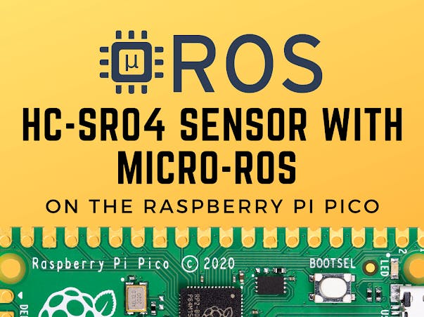
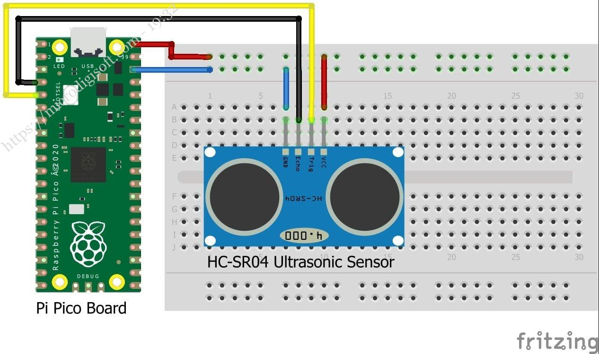

# HC-SR04 Sensor with micro-ROS on the Raspberry Pi Pico
**How to connect an HC-SR04 range sensor to a Raspberry Pi Pico and use micro-ROS to post its values to the ROS 2 graph.**



### Things used in this project
**Hardware components**
* SB Components Ultrasonic Distance Sensor (HC-SR04) × 1
* SB Components Pico Board With Soldered Header × 1	

**Software apps and online services**
* ROS Robot Operating System

### Story
We'll look at how to connect an [HC-SR04 range sensor](https://shop.sb-components.co.uk/products/ultrasonic-distance-sensor-hc-sr04) to a [Raspberry Pi Pico](https://shop.sb-components.co.uk/collections/raspberry-pi-pico-board) and use micro-ROS to post its values to the ROS 2 graph. This post expands on the previous one, [‘Getting started with micro-ROS on the Raspberry Pi Pico.'](https://github.com/oftharsh/cyprus-int-2023/blob/main/Micro-ROS%20on%20the%20Raspberry%20Pi%20Pico.md) As a result, if you're unfamiliar with the subject, I recommend reading it first.

[**_Raspberry Pi Pico with HC-SR04 Sensor and micro-ROS_**](https://shopmakergenix.blogspot.com/2021/06/hc-sr04-sensor-with-micro-ros-on.html)

### Sonar Sensors
We'll utilize a sonar, which is one of the most used sensors in robotics. Under ideal conditions, these sensors are inexpensive, simple to use, and remarkably accurate. Distances are measured with sonars. As a result, they may be used to identify and locate impediments, allowing a robot to avoid them. It's not difficult to see why they're so popular.

**So, what exactly is a sonar, how does it operate, and which should I choose?**
A sonar is an echolocation sensor that may be used to calculate distances. Sonars function in the same way as bats do to keep things simple to understand. They don't fly around at morning hunting bugs, nor do they combat crime. Obviously, I was referring to the way bats view the world. An transmitter and a receiver make up a sonar.

The former sends out an ultrasonic signal that bounces off of nearby objects and returns to the receiver. The distance travelled by the sound wave, and hence the distance to the obstruction that echoed the sound, may be simply calculated by monitoring the time difference between signal emission and reception.

If, for example, the sound wave is echoed away from the sensor, this technique might suffer from a variety of problems. Or if two barriers at different distances bounce it back to the sensor. Alternatively, it might be absorbed by a sound-dampening substance.

If you're still confused or want to learn more, I'll recommend you to your favorite online search engine because it's a bit outside the scope of this essay.

### HC-SR04 Range Sensor
I propose the **_‘HC-SR04P'_** model, which is a 3.3V version of the extremely popular ‘HC-SR04' type (5V). In this tutorial, I'll be utilizing this model (the HC-SR04P). It may be powered straight from the Pi Pico [RP2040 microcontroller](https://shop.sb-components.co.uk/products/rp2040) due to its low power consumption. As a result, the entire arrangement may be powered just by a USB cable.

If you're using a 5V package, please careful to adjust the wiring specified below, or your **_Raspberry Pi Pico_** might be damaged! For comparison, I paid less than $10 for a batch of five pieces, including delivery. With the Pi Pico pricing included, that's a lot of sensing for the money!

### Connecting the HC-SR04 Range Sonar Sensor to the Raspberry Pi Pico
The **_HC-SR04P_** board has four pins labelled "Vcc, " "Gnd, " "Trig, " and "Echo." The Vcc and Gnd pins, as you may have guessed, are for the 3.3V line and ground, respectively. The sensor is triggered by ‘Trig, ' and the reception of the echo is reported by ‘Echo' (the reception of the wave that bounced off of an obstacle).

**The wiring is simple from there, referring to the Pi Pico pinout:**

* 3V3 OUT (pin 36) to the ‘Vcc' of the sonar
* GND (pin 38) to the ‘Gnd' of the sonar
* GPIO 6 (pin 9) is connected to the ‘Echo' function of the sonar.
* GPIO 7 (pin 10) is connected to the sonar's 'Trig'.

**The arrangement is shown in the diagram below.**



In terms of hardware, we're finished. Let us now turn our attention to software.

**Micro-ROS code for the Raspberry Pi Pico**
We saw how to set up VSCode for developing micro-ros on the Raspberry Pi Pico in the last post, as well as how to build and flash a programme. As a result, we'll move right to the main course, bypassing all the boilerplate code and only showing the parts that are relevant to our application. However, this example (and many others) may be found on GitHub at artivis/mico ros.

So, let's get started. Our programme is made up of two functions: one that triggers and reads the sensor, and another, the timer callback, that calls the first, fills up a ROS message, and sends it out:

```
// The GPIO pins to which the sonar is wired
#define GPIO_ECHO 6
#define GPIO_TRIGGER 7
/**
* @brief Get the range value in meter.
*/
float read_range() {
// Send an impulse trigger of 10us
gpio_put(GPIO_TRIGGER, 1);
sleep_us(10);
gpio_put(GPIO_TRIGGER, 0);
// Read how long is the echo
uint32_t signaloff, signalon;
do {
signaloff = time_us_32();
} while (gpio_get(GPIO_ECHO) == 0);
do {
signalon = time_us_32();
} while (gpio_get(GPIO_ECHO) == 1);
// Actual echo duration in us
const float dt = signalon - signaloff;
// distance in meter:
// echo duration (us) x speed of sound (m/us) / 2 (round trip)
return dt * 0.000343 / 2.0;
}
...
/**
* @brief Read the range from the sensor,
* fill up the ROS message and publish it.
*/
void timer_callback(rcl_timer_t *timer, int64_t /*last_call_time*/) {
if (timer) {
range_msg.range = read_range();
fill_msg_stamp(range_msg.header.stamp);
rcl_publish(&publisher, &range_msg, NULL);
} else {
printf("Failed to publish range. Continuing.\n");
}
}
```

That's all there is to it. The remainder of the code is basically boilerplate, including initializing the GPIO, configuring the micro-ROS node, publisher, timer, and executor, and spinning everything up.

The usual ‘sensor msgs/msgs/Range' message is being used. The ROS2 API documentation contains its definition and a breakdown of its field.

Now all that's left is to compile the code, flash the resultant ".uf2" file, and run the micro-ROS agent.

If everything went well while compiling and flashing, all we have to do now is connect the board to our computer and run the micro-ROS agent. We use the following command to accomplish so:

``` docker run -it --rm -v /dev:/dev --privileged --net=host microros/micro-ros-agent:foxy serial --dev /dev/ttyACM0 -b 115200 ```

Let's see what we can come up with.
```
$ ros2 topic list
/parameter_events
/pico/range
/rosout
```

It's a good start that the subject /pico/range is publicized. Let's have a look at what's within.
```
$ ros2 topic echo /pico/range
header:
stamp:
sec: 145
nanosec: 837599000
frame_id: pico_sonar_0_link
radiation_type: 0
field_of_view: 30.0
min_range: 0.019999999552965164
max_range: 4.0
range: 12.138598442077637
---
header:
stamp:
sec: 145
nanosec: 915356000
frame_id: pico_sonar_0_link
radiation_type: 0
field_of_view: 30.0
min_range: 0.019999999552965164
max_range: 4.0
range: 12.138941764831543
---
```

You may now experiment with your new sensor by moving an obstacle in front of it back and forth. Using a measuring tape, compare the reported and measured distances. You might be shocked by how accurate it is, as I was.

**Reference**
[OpenCV-OpenGL](https://docs.opencv.org/3.4/d2/d3c/group__core__opengl.html)
[ROS cv-bridge](http://wiki.ros.org/cv_bridge)
[Roboacademy](https://robocademy.com/)