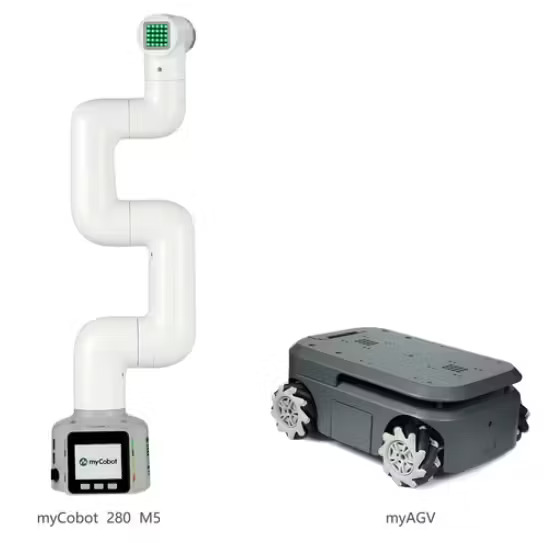

# Building a Smart Navigation System using myCobot and myAGV
**Here is a documentation of the development of an automated navigation project with myAGV and myCobot.**

https://github.com/krinkin/cyprus-int-2023/assets/93001442/fbd9b219-030e-4123-af05-20726e12d41a

## Things used in this project
**Hardware components**
* Elephant Robotics myAGV ×1	
* Elephant Robotics myCobot-6 DOF collaborative robot ×1	
* Raspberry Pi 4 Model B ×1	

**Software apps and online services**
* ROS Robot Operating System

**Hand tools and fabrication machines**
* Elephant Robotics Adaptive Gripper

### Story

**Introduction**

As a developer, I am currently involved in an interesting project to combine a SLAM (Simultaneous Localization and Mapping) car, [myAGV](https://www.elephantrobotics.com/en/myagv-new-en/), with a small six-axis robotic arm, [myCobot 280 M5Stack](https://www.elephantrobotics.com/en/mycobot-en/), for research on logistics automation in education and scientific fields.

myAGV is a small car that can perform mapping and navigation and uses [Raspberry Pi 4B](https://www.raspberrypi.com/) as the controller. It can locate and move indoors and outdoors. MyCobot280 is a small collaborative robotic arm with six degrees of freedom that can accomplish various tasks in limited space.

My project goal is to integrate these two devices to achieve automated logistics transportation and placement. We plan to use open-source software and existing algorithms to achieve autonomous navigation, localization, mapping, object grasping, and placement functions. Through documenting the process in this article, we aim to share our journey in developing this project.

**The equipment that I am using includes:**

myAGV, a SLAM car that is capable of mapping and navigation.


myCobot280 M5Stack, a six-axis collaborative robotic arm with a complete API interface that can be controlled via [Python](https://www.python.org/).



An adaptive gripper that can be mounted as an end effector with MyCobot280, which is capable of grasping objects.


Development environment:

**_Ubuntu 18.04, Python 3.0+, ROS1._**

Note: myAGV is controlled by Raspberry Pi 4B, and all environment configurations are based on the configurations provided on the Raspberry Pi.

**Project**
The picture below shows the general flow of this project.


I split the function into one, a small part to be implemented independently and finally integrated together.

**myAGV**
Firstly, I am working on the functions of myAGV, to perform mapping and automated navigation. I am implementing these functions based on the information provided in the [official Gitbook.](https://docs.elephantrobotics.com/docs/gitbook-en/13-AdvancedKit/13.2MobileCompoundRobot/13.2.1quickstart.html)

I am using the gmapping algorithm to perform mapping. Gmapping, also known as grid-based mapping, is a well-established algorithm for generating 2D maps of indoor environments. It works by building a grid map of the environment using laser range finder data, which can be obtained from the sensors mounted on myAGV.


It's worth noting that I have tried myAGV in various scenarios, and the mapping performance is good when the environment is relatively clean. However, when the surrounding area is complex, the mapping results may not be as good. I will try to improve it by modifying the hardware or software in the future.

The picture below shows myAGV performing automatic navigation.


During automatic navigation, myAGV still experiences deviations. Implementing navigation functionality is quite complex because the navigation conditions are quite strict. It is necessary to adjust the actual position of myAGV after enabling navigation and turn in place to determine if the position is correct. There are still many areas for improvement in navigation functionality, such as automatically locating the position of the small car on the map after enabling navigation, among other aspects.

**myCobot 280**
After handling the myAGV, the next step is to control the myCobot movement.

Here, I use Python to control myCobot 280. Python is an easy-to-use programming language, and myCobot's Python API is also quite comprehensive. Below, I will briefly introduce several methods in pymycobot.
```
time.sleep()
Function: Pause for a few seconds (the robotic arm needs a certain amount of time to complete its movement).
send_angles([angle_list], speed)
Function: Send the angle of each joint and the speed of operation to the robot arm.
set_gripper_value(value, speed)
Function: Controls the opening and closing of the jaws, 0 is closed 100 is open, 0 to 100 adjustable
```
Wrote a simple program to grab objects, see GIF demo.


**Establishing communication**
After dealing with the small functions, the next step is to establish communication between myCobot and myAGV.

* The controller of myAGV is a Raspberry Pi, which is a micro-computer (with Ubuntu 18.04 system) that can be programmed on it.
* MyCobot 280 M5Stack needs to be controlled by commands sent from a computer.

Based on the above conditions, there are two ways to establish communication between them:

* Serial communication: directly connect them using a TypeC-USB data cable (the simplest and most direct method).
* Wireless connection: myCobot supports WIFI control, and commands can be sent by entering the corresponding IP address (more complicated and communication is not stable).

Here, I choose to use serial communication and directly connect them with a data cable.


Here I recommend a software called [VNC Viewer](https://www.realvnc.com/en/connect/download/viewer/), which is a cross-platform remote control software. I use VNC to remotely control myAGV, which is very convenient because I don't have to carry a monitor around.

If you have any better remote control software, you can leave a comment below to recommend it to me.

Let's see how the overall operation works.

**Summary**
In this project, only simple SLAM-related algorithms are used. The navigation algorithm needs to be further optimized to achieve more accurate navigation. As for the usage of myCobot, it is a relatively mature robotic arm with a convenient interface, and the end effectors provided by the [Elephant Robotics](https://www.elephantrobotics.com/en/) can meet the requirements without the need to build a gripper for the project.

There are still many aspects of the project that need to be optimized, and I will continue to develop it in the future. Thank you for watching, and if you have any interest or questions, please feel free to leave a comment below.

**Reference**
[OpenCV-OpenGL](https://docs.opencv.org/3.4/d2/d3c/group__core__opengl.html)
[ROS cv-bridge](http://wiki.ros.org/cv_bridge)
[Roboacademy](https://robocademy.com/)
[Sina from Hacker.io](https://www.hackster.io/kehu199910)