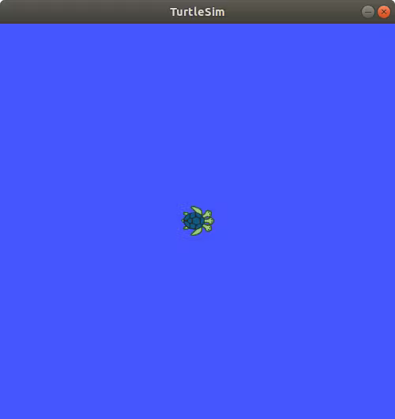
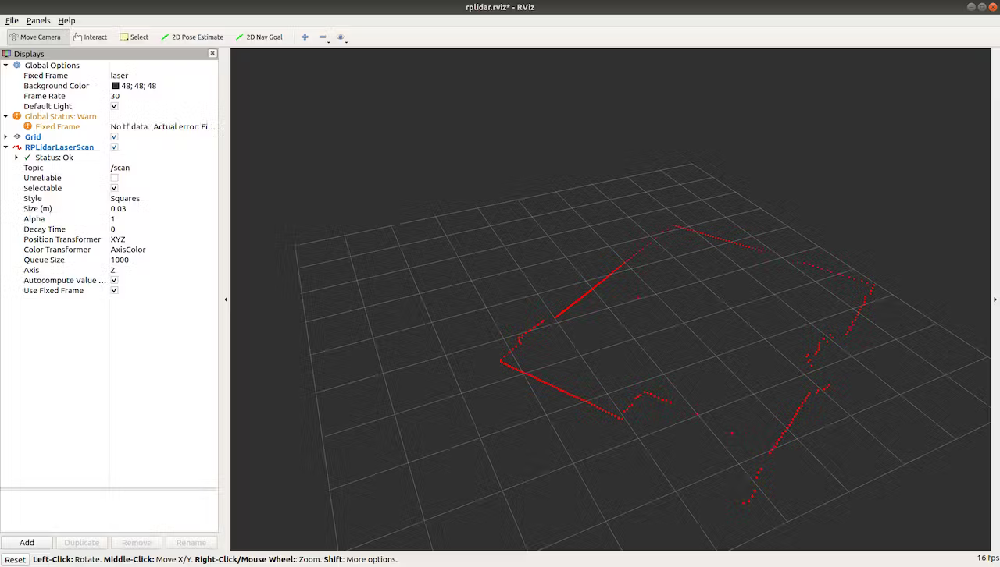

# Getting Started with ROS Melodic on Raspberry Pi 4 Model B
In this tutorial, you will learn how to connect a LiDAR to your Raspberry Pi 4 Model B using ROS Melodic on Ubuntu Desktop 18.04.3.

## Things used in this project
**Hardware components**
1. Raspberry Pi 4 Model B ×1	
2. RPLidar A1M8 ×1	

**Software apps and online services**
1. ROS Robot Operating System

**Story**
The Robot Operating System (ROS) is a set of software libraries and tools used to build robotic systems and applications. The current long term service version of ROS is **Melodic Morenia.** ROS Melodic is compatible with only Ubuntu 18.04 Bionic Beaver. However, it also runs on other Linux systems as well as Mac OS X, Android, and Windows. And it only supports 64-bit operating systems. We need to install the 64-bit version of Ubuntu first. Then we will be able to install ROS. If you want to use 32-bit architecture, you will need to install ROS from source. It's not hard, but it will take a long time to compile everything.

Fortunately, there’s a way to bring the popular Ubuntu desktop operating system to your Raspberry Pi 4 Model B. There is an unofficial distribution of Ubuntu Desktop and Server 18.04.3 for Raspberry Pi 4. The image and source code can be dowloaded from here. More detailed information can be found here.

In this guide, you will learn how to connect your LiDAR to Raspberry Pi 4 Model B using ROS Melodic middleware on Ubuntu Desktop 18.04.3. All you’ll need is a microSD card of at least 32GB, microSD card reader, Raspberry Pi 4 Model B and **RPLidar A1M8.** A RPLIDAR is a low cost LIDAR sensor from Slamtec suitable for indoor robotic applications.

**Install Ubuntu Desktop 18.04.3 on the Raspberry Pi 4 Model B**
* Download the image of Ubuntu Server 18.04.3. Click here to Download.
* Flash the microSD card using Etcher.
* Attach the monitor and keyboard to the board
* Insert the microSD card into your Raspberry Pi 4
* Power it up
* Default credential to login in is:
```ubuntu login: ubuntu```
```Password: ubuntu```
* You will be required to change the default password to something else.
* Update and upgrade your Ubuntu with the latest packages by typing below commands. Open the terminal and run the following   command:
```sudo apt-get update```
* Next command updates the list of available packages and their versions.
```sudo apt-get upgrade```

**Read data from your RPLiDAR**
Connect your RPLiDAR to Raspberry Pi 4 Model B using Micro USB Cable. Flashing green light indicates normal activity of sensor.
Once you have connected the RPLiDAR to your Raspberry Pi, type the following command line to check the permissions:

Open your terminal and run the following command.
```ls -l /dev | grep ttyUSB```

Output of the following command must be:
```crw-rw----  1 root   dialout 188,   0 Jan  3 14:59 ttyUSB```

Run below command to change permission:
```sudo chmod 666 /dev/ttyUSB0```

Now you are able to read and write with this device using the USB port.

Verify it using above command:
```crw-rw-rw-  1 root   dialout 188,   0 Jan  3 14:59 ttyUSB0```

Once the permissions are configured, you have to download and install the ROS packages.

**Installation of ROS Melodic on Raspberry Pi 4 Model B**

Now, we are ready to install the ROS packages on Ubuntu 18.04 LTS based on Raspberry Pi 4. Set up the Raspberry Pi to accept software from packages.ros.org by entering the following command on terminal:
```sudo sh -c 'echo "deb http://packages.ros.org/ros/ubuntu $(lsb_release -sc) main" > /etc/apt/sources.list.d/ros-latest.list'```

The following key should be added to Ubuntu before starting the installation, which will ensure the download comes from an authorized server. Run the below command on terminal:
```sudo apt-key adv --keyserver 'hkp://keyserver.ubuntu.com:80' --recv-key C1CF6E31E6BADE8868B172B4F42ED6FBAB17C654```

And you will see the following output:
```
Executing: /tmp/apt-key-gpghome.1kWt1g8IvN/gpg.1.sh --keyserver hkp://keyserver.ubuntu.com:80 --recv-key C1CF6E31E6BADE8868B172B4F42ED6FBAB17C654
gpg: key F42ED6FBAB17C654: public key "Open Robotics <info@osrfoundation.org>" imported
gpg: Total number processed: 1
gpg:               imported: 1
```
The next step is to update the list of packages by using the following command:
```sudo apt upgrade```

If you will see the following error in the terminal:
```
Reading package lists... Done
E: Could not get lock /var/lib/apt/lists/lock - open (11: Resource temporarily unavailable)
E: Unable to lock directory /var/lib/apt/lists/
```
It can be solved by running following command:
```sudo rm /var/lib/apt/lists/lock```

Run again **sudo apt upgrade.**

There are three prepackaged versions of ROS you can choose from. Which one you pick will depend on your needs for the computer you're installing ROS.
* Desktop-Full Install
* Desktop Install
* ROS-Base

ROS Desktop Full is a more complete package, however it is not recommended for single board computers such as Raspberry Pi or Nvidia Jetson Nano. So, **Desktop install** will be installed. It installs all the software, tools, algorithms, and robot simulators for ROS, including support for rqt, rviz and other useful robotics packages. You can install ROS Melodic Desktop 

**Install by issuing the below command:**
```sudo apt install ros-melodic-desktop```

After you type the command and press Enter, press Y and hit Enter when asked if you want to continue.

### ROS Dependencies
**RosDep** is a tool that lets you easily install system dependencies.

To initialize RosDep use the following command in the terminal:
```sudo rosdep init```

You will see the following output:
```
Wrote /etc/ros/rosdep/sources.list.d/20-default.list
Recommended: please run
rosdep update
```
The next step to run below command:
```rosdep update```

You may see the following error in terminal:
```
updated cache in /home/ubuntu/.ros/rosdep/sources.cache
ERROR: Not all sources were able to be updated.
[[[
ERROR: unable to process source [https://raw.githubusercontent.com/ros/rosdistro/master/rosdep/osx-homebrew.yaml]:
<urlopen error ('_ssl.c:711: The handshake operation timed out',)> (https://raw.githubusercontent.com/ros/rosdistro/master/rosdep/osx-homebrew.yaml)
]]]
```
Run again **rosdep update** till the error will disappear. In my case it was done 3 times.

**Configuring environment**
We have ROS and the dependencies installed. Let’s configure our environment. ROS is installed at **/opt/ros/melodic.**
In order to have ROS commands available, it’s needed to source the shell file inside of the installation folder.
```echo "source /opt/ros/melodic/setup.bash" >> ~/.bashrc```

Then run the following command in terminal:
```source ~/.bashrc```

Here is the last step of the installation process. Check which version of ROS you have installed. If you see your ROS version as the output, congratulations you have successfully installed ROS. Run the below command.
```rosversion -d```

If everything is correct, we will get the following screen:
```melodic```

Now the Raspberry Pi 4 is ready to execute ROS packages.

**Testing functionality of ROS**
Let’s try some ROS commands to make sure the installation has finished successfully. We will execute the following commands to check whether the installation is correct. A simple way to check the functionality of ROS is to use the **turtlesim** simulator that is part of the ROS installation.

Open a new terminal and run the following command:
```roscore```

If everything goes right, you will obtain the following result on current terminal:
```
... logging to /home/ubuntu/.ros/log/d9439b6c-2e70-11ea-b473-dca6320e071e/roslaunch-ubuntu-3563.log
Checking log directory for disk usage. This may take awhile.
Press Ctrl-C to interrupt
Done checking log file disk usage. Usage is <1GB.
started roslaunch server http://ubuntu:37629/
ros_comm version 1.14.3
SUMMARY
========
PARAMETERS
* /rosdistro: melodic
* /rosversion: 1.14.3
NODES
auto-starting new master
process[master]: started with pid [3574]
ROS_MASTER_URI=http://ubuntu:11311/
setting /run_id to d9439b6c-2e70-11ea-b473-dca6320e071e
process[rosout-1]: started with pid [3585]
started core service [/rosout]
```
Start a new terminal prompt and run the below command in the terminal:
```rosrun turtlesim turtlesim_node```

If everything is correct, we will get the following screen:


_Congratulations! We are done with the ROS installation._

**Configure a catkin workspace and visualize data**
You must create and configure a **catkin** workspace. A catkin workspace is a directory in which you can create or modify existing catkin packages.

Install the following dependencies. Open a new terminal and type:
```
sudo apt-get install cmake python-catkin-pkg python-empy python-nose python-setuptools libgtest-dev python-rosinstall python-rosinstall-generator python-wstool build-essential git
```
Create the catkin root and source folders:
```mkdir -p ~/catkin_ws/src```

This workspace can be compiled even it is empty.
Go to the source folder of the catkin workspace that you just created. In your terminal, run
```cd ~/catkin_ws/src```

Clone the github repository of RPLIDAR ROS package.
```git clone https://github.com/robopeak/rplidar_ros.git```

And then
```cd ~/catkin_ws```

Then, run catkin_make to compile your catkin workspace.
```catkin_make```

Then run to source the environment with your current terminal. Don't close the terminal.
```source devel/setup.bash```

To start ROS, run the following command in a new terminal:
```roscore```

In the terminal which you sourced the environment, run below command
```roslaunch rplidar_ros view_rplidar.launch```

An instance of **Rviz** will then open with a map of the RPLIDAR’s surroundings.


If you want to learn more about **Rviz,** read this [tutorial](http://wiki.ros.org/rviz).

**Final result of the tutorial**
That’s it! You have ROS Melodic installed and ready to use!
I hope you found this guide useful and thanks for reading. 
**References:**
[Hackster](https://www.hackster.io/)
[<Packt>](https://www.packtpub.com/product/ros-robotics-projects)
[Skyfi labs](https://www.skyfilabs.com/blog/10-simple-ros-projects-for-beginners)
[Robocademy](https://robocademy.com/2020/10/15/open-source-ros-projects-from-ros-developer-learning-path/)
