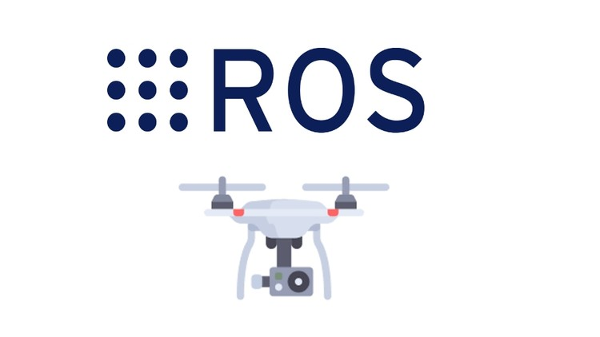

# A ROS package to communicate ESPcopters using wifi
**This repo contains the firmware of ESPcopter that enables this drone to communicate with ROS.**



## Things used in this project
**Hardware components**
*  ESP8266 ESP-12E ×	1	
* ESPcopter ×1	

**Software apps and online services**
* Arduino IDE
* ROS Robot Operating System

### Story
**Available Features**
This driver enables you to communicate espcopters with ros using wifi. The available topics are:
```
$ rostopic list 
/drone_1/attitude # set the attitude of the drone controlling via PID.
/drone_1/attitude_status # get the current attitude of the drone.
/drone_1/battery # Battery voltage status.
/drone_1/command_status # get the current command sent to the drone.
/drone_1/imu # Gyro and accelerometer data.
/drone_1/led # Control the RGB led on the drone.
/drone_1/mag # Magnetometer data.
/drone_1/motors # Control each motor individually.
```

Also, we provide some services that allow the user tocalibrate the drone:
```
$ rosservice list
/drone_1/arm_motors # arm/disarm the drone motors (toggle). 
/drone_1/gyro_calibration # start gyro calibration process.
/drone_1/mag_calibration # start magnetometer calibration process.
```

### How to build this firmware and install it on your ESPcopter

**Arduino Installation**
* Install the latest version from the Arduino website.
* The following driver is required for the ESPcopter to be recognized by the computer. Download and install the appropriate driver version for your OS.

**ESP8266 Library**

* One needs to update the board manager with a custom URL to enable Arduino to compile esp8266 MCU. Open up Arduino, then go to the Preferences (File > Preferences). Then, towards the bottom of the window, copy this URL into the “Additional Board Manager URLs” text box:
``` http://arduino.esp8266.com/stable/package_esp8266com_index.json ```

* Hit OK. Then navigate to the Board Manager by going to (Tools > Boards > Boards Manager). There should be a couple ofnew entries in addition to the standard Arduino boards. Look for esp8266. Click on that entry, then select Install. You need to install 2.5.0 version of theesp8266 library.

* The download process can take up to 10 minutes depending on your internet speed. After the download is done, select NodeMCU 1.0 from the Tools tab and follow the other settings.

**Downloading the ESPcopter library:** 
* Access your ROSworkspace and clone this repo:
```
$ cd catkin_ws/src
$ git clone https://github.com/verlab/espcopter.git
$ cd ..
$ catkin_make # or catkin build
```
* Fixing dependecies:
``` $ rosdep install espcopter ```

* Open the **espcopter.ino** file using arduino ide and connect the ESPCopter with the computer using a micro USB cable.
* Setup your WiFi network in the code:
```
/*********************************************************
   WIFI SETUP
*********************************************************/
IPAddress ROS_MASTER_ADDRESS(10, 42, 0, 1); // ros master ip
char* WIFI_SSID = "hero_network"; // network name
char* WIFI_PASSWD = "s3cr3tp4ss"; // network password
/*********************************************************/
```
* Check if the switch on the drone is ON position, and compile and burn the code into esp8266.

**How to connect the drone with ROS** 
* Open a terminal and run the roslaunch to bringup the drones:
 ```
$ roslaunch espcopter espcopter_bringup.launch
waiting for socket connection
[INFO] [1579104505.608789]: Established a socket connection from 10.42.0.127 on port 49154
[INFO] [1579104505.609296]: calling startSerialClient
[INFO] [1579104507.713159]: Requesting topics...
[INFO] [1579104507.761302]: Note: publish buffer size is 1024 bytes
[INFO] [1579104507.761692]: Setup publisher on /drone_1/battery [mavros_msgs/BatteryStatus]
[INFO] [1579104507.767787]: Setup publisher on /drone_1/imu [sensor_msgs/Imu]
[INFO] [1579104507.771223]: Setup publisher on /drone_1/mag [sensor_msgs/MagneticField]
[INFO] [1579104507.774226]: Setup publisher on /drone_1/attitude_status [mavros_msgs/AttitudeTarget]
[INFO] [1579104507.778017]: Setup publisher on /drone_1/command_status [mavros_msgs/AttitudeTarget]
[INFO] [1579104507.782331]: Setup service server on /drone_1/arm_motors [std_srvs/Trigger]
[INFO] [1579104507.785847]: Setup service server on /drone_1/gyro_calibration [std_srvs/Trigger]
[INFO] [1579104507.789240]: Setup service server on /drone_1/mag_calibration [std_srvs/Trigger]
[INFO] [1579104507.790900]: Note: subscribe buffer size is 1024 bytes
[INFO] [1579104507.797960]: Setup subscriber on /drone_1/led [std_msgs/ColorRGBA]
[INFO] [1579104507.802273]: Setup subscriber on /drone_1/motors [mavros_msgs/RCOut]
[INFO] [1579104507.806879]: Setup subscriber on /drone_1/attitude [mavros_msgs/AttitudeTarget]
[INFO] [1579104510.619883]: [/drone_1] Conected at time: 18709, loop_freq: 15289.000000, battery: 4246.000000
[INFO] [1579104515.617136]: [/drone_1] Conected at time: 23710, loop_freq: 15096.000000, battery: 4240.500000
[INFO] [1579104520.604998]: [/drone_1] Conected at time: 28711, loop_freq: 15520.000000, battery: 4240.500000
```

**How to teleoperate the drone using joystick**

* A demo teleop.py script should be modified as you like to fit the control as your joystick.

* Open a terminal and run the roslaunch to teleoperate the drone:
``` $ roslaunch espcopter espcopter_teleop.launch ```

**Video Demo:** 
[Youtube](https://youtu.be/EU-h9ybTBbI)

**Credits and References:**
[Metehan Emilk](https://www.hackster.io/metehan-emlik)
[OpenCV-OpenGL](https://docs.opencv.org/3.4/d2/d3c/group__core__opengl.html)
[ROS cv-bridge](http://wiki.ros.org/cv_bridge)
[Roboacademy](https://robocademy.com/)

