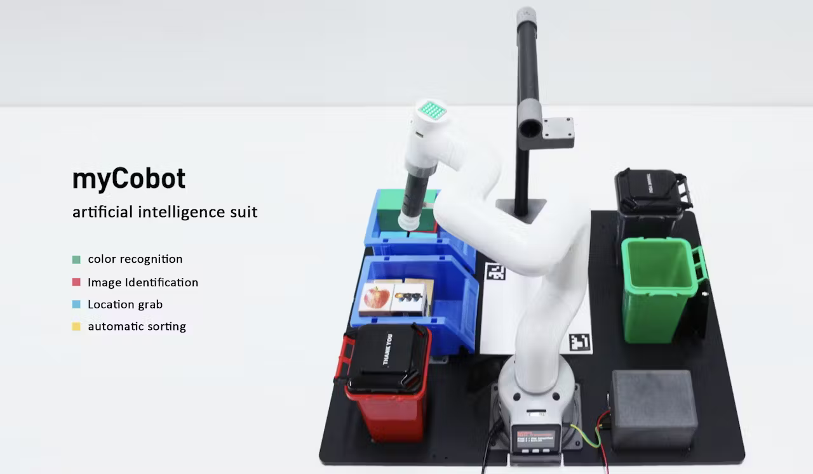

# Robot vision and human-robot interaction in myCobot AI Kit
Details of robot vision and human-robot interaction with myCobot AI Kit

## Things used in this project
**Hardware components**
ESP32 Basic Core IoT Development Kit	
M5Stack ESP32 Basic Core IoT Development Kit ×1	

**Hand tools and fabrication machines**
myCobot 280 M5Stack 2023	
Elephant Robotics myCobot 280 M5Stack 2023

## Story

**Introduction**
What is AI Kit?

Based on the Linux system and a 1:1 simulation model in ROS, the AI Kit composes of the vision, accurate grabbing, and automatic sorting modules. Featuring robot vision, an equipped camera can recognize and locate the blocks of different colors or images through OpenCV, and then the core processor of the a robotic arm can calculate their current and targeted spatial coordinate positions, and finally grab a block into the corresponding buckets.

Let's talk about the in-depth understanding of AI Kit algorithms.



Color recognition refers to grabbing the corresponding color blocks and putting them into the corresponding color buckets within the recognition area and range.

**Video Demo:**

**Process:**
The process is to return the coordinate data of the wooden block to the computer after OpenCV recognizes the object under the camera, gets the actual coordinates of the wooden block through calculation, and then transfers the actual coordinates of the wooden block to the robot arm to perform the grabbing.

_To achieve this, we need to solve two problems._

1. How to get information of the block?

2. How to get the real coordinates from the information of the blocks？

* How to get information of the blocks?

* We can get the information of the blocks through the OpenCV.

* The color processing of OpenCV
 
* Put HSV of red, yellow, blue and green in the library.

### Code:

**#set color HSV**
```
self.HSV = {
"yellow": [np.array([11, 115, 70]), np.array([40, 255, 245])],
"red": [np.array([0, 43, 46]), np.array([8, 255, 255])],
"green": [np.array([35, 43, 46]), np.array([77, 255, 255])], # [77, 255, 255]
"blue": [np.array([100, 43, 46]), np.array([124, 255, 255])],
"cyan": [np.array([78, 43, 46]), np.array([99, 255, 255])], # np.array([78, 43, 46]), np.array([99, 255, 255])
}
    def color_detect(self, img):
        # set the arrangement of color'HSV
        x = y = 0
        for mycolor, item in self.HSV.items():
            redLower = np.array(item[0])
            redUpper = np.array(item[1])
            # transfrom the img to model of gray
            hsv = cv2.cvtColor(img, cv2.COLOR_BGR2HSV)
            # wipe off all color expect color in range
            mask = cv2.inRange(hsv, item[0], item[1])
            ...
```
If the other colors don't have the HSV parameter added, then the block will be grabbed into the gray bucket by default in the program.

After successfully recognising the color, it's time to get the coordinate information of the block.

The final returned data is the coordinates of the center point of the blocks.

### Code：

**#detect cube color**
```
    def color_detect(self, img):
        # set the arrangement of color'HSV
        x = y = 0
        for mycolor, item in self.HSV.items():
            redLower = np.array(item[0])
            redUpper = np.array(item[1])
            # transfrom the img to model of gray
            hsv = cv2.cvtColor(img, cv2.COLOR_BGR2HSV)
            # wipe off all color expect color in range
            mask = cv2.inRange(hsv, item[0], item[1])
            # a etching operation on a picture to remove edge roughness
            erosion = cv2.erode(mask, np.ones((1, 1), np.uint8), iterations=2)
            # the image for expansion operation, its role is to deepen the color depth in the picture
            dilation = cv2.dilate(erosion, np.ones(
                (1, 1), np.uint8), iterations=2)
            # adds pixels to the image
            target = cv2.bitwise_and(img, img, mask=dilation)
            # the filtered image is transformed into a binary image and placed in binary
            ret, binary = cv2.threshold(dilation, 127, 255, cv2.THRESH_BINARY)
            # get the contour coordinates of the image, where contours is the coordinate value, here only the contour is detected
            contours, hierarchy = cv2.findContours(
                dilation, cv2.RETR_EXTERNAL, cv2.CHAIN_APPROX_SIMPLE)


            if len(contours) > 0:
                # do something about misidentification
                boxes = [
                    box
                    for box in [cv2.boundingRect(c) for c in contours]
                    if min(img.shape[0], img.shape[1]) / 10
                    < min(box[2], box[3])
                    < min(img.shape[0], img.shape[1]) / 1
                ]
                if boxes:
                    for box in boxes:
                        x, y, w, h = box
                    # find the largest object that fits the requirements
                    c = max(contours, key=cv2.contourArea)
                    # get the lower left and upper right points of the positioning object
                    x, y, w, h = cv2.boundingRect(c)
                    # locate the target by drawing rectangle
                    cv2.rectangle(img, (x, y), (x+w, y+h), (153, 153, 0), 2)
                    # calculate the rectangle center
                    x, y = (x*2+w)/2, (y*2+h)/2
                    # calculate the real coordinates of mycobot relative to the target
                    if mycolor == "red":
                        self.color = 0
                    elif mycolor == "green":
                        self.color = 1
                    elif mycolor == "cyan":
                        self.color = 2
                    else:
                        self.color = 3
        if abs(x) + abs(y) > 0:
            return x, y
        else:
            return None
```
* How to get the real coordinates from the information of the blocks？

_To solve this problem, we need to deal with the ratio between the distance in computer and reality._


Except for the coordinates of the blocks in the recognition area, the rest of the parameters are known, such as the distance of the camera from the center point of the robotic arm base, the length of the Arcuo board, and the coordinates of the center of the Arcuo board, so the ratio is also known.


(The coordinates of the buckets have been set in the program in advance. When the corresponding colors are identified, the blocks will be grabbed into the corresponding buckets. The blocks of other colors that are not added in advance in HSV will be put into gray buckets)

Therefore, we can get the distance in the computer and then calculate the actual distance of d to achieve this function.

### Code:

**#open the camera**
```
    cap_num = 0
    cap = cv2.VideoCapture(cap_num, cv2.CAP_V4L)


    if not cap.isOpened():
        cap.open()
    # init a class of Object_detect
    detect = Object_detect()
    # init mycobot
    detect.run()


    _init_ = 20  #
    init_num = 0
    nparams = 0
    num = 0
    real_sx = real_sy = 0
    while cv2.waitKey(1) < 0:
       # read camera
        _, frame = cap.read()
        # deal img
        frame = detect.transform_frame(frame)


        if _init_ > 0:
            _init_ -= 1
            continue
        # calculate the parameters of camera clipping
        if init_num < 20:
            if detect.get_calculate_params(frame) is None:
                cv2.imshow("figure", frame)
                continue
            else:
                x1, x2, y1, y2 = detect.get_calculate_params(frame)
                detect.draw_marker(frame, x1, y1)
                detect.draw_marker(frame, x2, y2)
                detect.sum_x1 += x1
                detect.sum_x2 += x2
                detect.sum_y1 += y1
                detect.sum_y2 += y2
                init_num += 1
                continue
        elif init_num == 20:
            detect.set_cut_params(
                (detect.sum_x1)/20.0,
                (detect.sum_y1)/20.0,
                (detect.sum_x2)/20.0,
                (detect.sum_y2)/20.0,
            )
            detect.sum_x1 = detect.sum_x2 = detect.sum_y1 = detect.sum_y2 = 0
            init_num += 1
            continue


        # calculate params of the coords between cube and mycobot
        if nparams < 10:
            if detect.get_calculate_params(frame) is None:
                cv2.imshow("figure", frame)
                continue
            else:
                x1, x2, y1, y2 = detect.get_calculate_params(frame)
                detect.draw_marker(frame, x1, y1)
                detect.draw_marker(frame, x2, y2)
                detect.sum_x1 += x1
                detect.sum_x2 += x2
                detect.sum_y1 += y1
                detect.sum_y2 += y2
                nparams += 1
                continue
        elif nparams == 10:
            nparams += 1
            # calculate and set params of calculating real coord between cube and mycobot
            detect.set_params(
                (detect.sum_x1+detect.sum_x2)/20.0,
                (detect.sum_y1+detect.sum_y2)/20.0,
                abs(detect.sum_x1-detect.sum_x2)/10.0 +
                abs(detect.sum_y1-detect.sum_y2)/10.0
            )
            print ("ok")
            continue


        # get detect result
        detect_result = detect.color_detect(frame)
        if detect_result is None:
            cv2.imshow("figure", frame)
            continue
        else:
            x, y = detect_result
            # calculate real coord between cube and mycobot
            real_x, real_y = detect.get_position(x, y)
            if num == 20:
                detect.pub_marker(real_sx/20.0/1000.0, real_sy/20.0/1000.0)
                detect.decide_move(real_sx/20.0, real_sy/20.0, detect.color)
                num = real_sx = real_sy = 0


            else:
                num += 1
                real_sy += real_y
                real_sx += real_x


        cv2.imshow("figure", frame)
```
**Summary**
The problems can be solved through using the algorithms above, and we can achieve applications in robot vision and human-robot interaction. The myCobot AI Kit can quickly start with machine vision and artificial intelligence-related information.

**The complete code is on GitHub:**

[Github](https://github.com/elephantrobotics/mycobot_ros/blob/mycobot_ai/mycobot_ai/ai_mycobot_280/scripts/combine_detect_obj_color.py)

**Detailed video on YouTube:**
[Youtube](https://www.youtube.com/watch?v=Y51VIikAhcs)

**References:**
[Hackster](https://www.hackster.io/)
[<Packt>](https://www.packtpub.com/product/ros-robotics-projects)
[Skyfi labs](https://www.skyfilabs.com/blog/10-simple-ros-projects-for-beginners)
[Robocademy](https://robocademy.com/2020/10/15/open-source-ros-projects-from-ros-developer-learning-path/)