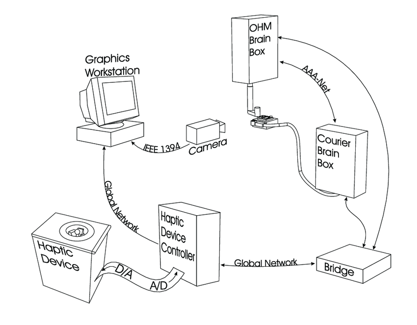

# Teleoperate robot using EASE with ROS
Use ROS (running on Esmacat Master S) to teleoperate robot in Gazebo simulation environment using analog input from LCD Shield with EASE.

## Things used in this project
**Hardware components**

1) Esmacat Master S ×	1
_To run ROS and Gazebo Simulation environment_
	
2) EtherCAT Arduino Shield by Esmacat (EASE)  ×	1
_EtherCAT Slave_
	
3) Arduino UNO ×	1	

4) Ethernet Cable, Cat6a ×	2

5) Power over Ethernet (POE) Injector ×	1	

6) DC Adapter ×	1	 
_DC Adapter to power the EASE and Arduino boards_

7) 16x2 LCD Shield ×	1	


### Software apps and online services

1) Arduino IDE
_To flash the arduino code into the Arduino Uno board._

2) ROS Robot Operating System
_ROS kinetic or above to interface with the EASE board._

3) Gazebo Simulation Software


**Overview:**

In this tutorial, you will learn how to set up an Esmacat Master S running Robot Operating System (ROS) to act as an EtherCAT master. It will be used to control a differential drive robot using the EtherCAT Arduino Shield by Esmacat (EASE) Slave device.

* First, some general information about the EtherCAT Master and ROS is discussed.
* After learning to set up the EtherCAT Master, you will learn to implement a practical project to teleoperate a differential drive robot in the Gazebo Simulation environment using analog value input from the LCD Shield with EASE using ROS.

**EtherCAT Arduino Shield by Esmacat (EASE):**
EASE is an EtherCAT slave that connects to an EtherCAT master (Raspberry Pi/PC/ Laptop/ Dedicated EtherCAT Master devices like the Esmacat Master S and Esmacat Master C.) It can be stacked on top of Arduino, other MCU boards with an Arduino Uno form factor, and shields. This shield allows high-speed communication with an industry-standard EtherCAT protocol for high-performance robotic applications. Esmacat's simple to use Arduino and Mbed libraries allow for easy coding on the baseboard and Esmacat's free open source EtherCAT master software has a high-level abstraction so users can run applications within minutes!

**Feature Highlights:**

* EASE connects Arduino boards, Arduino-like boards, and Arduino Shields for large-scale applications.
* High-speed communication (200Mbps, 200x faster than CAN bus) is supported with EtherCAT which is an industrial-standard Fieldbus for automation.
* The EtherCAT hardware/software is present only on EASE so there is no performance lost on the MCU baseboard.
* EASE has the form factor of Arduino Uno and thus can take advantage of the Arduino ecosystem.
* Daisy chain connection between multiple EASE simplifies the topology of wiring.
* Power-over-EtherCAT (POE) technology reduces the number of required wires and power outlets.
* The data packet between Arduino Board and EASE is communicated via SPI, allowing EASE to be compatible with many different   types of boards including Arduino boards and MBed boards.
* Arduino and Mbed developed by Esmacat library allow users to easily develop code between the baseboard and EASE within      minutes.
* This shield has 8 registers that can be used to send/receive data between devices through the EtherCAT master via Ethernet   cables attached to the shield.
More info: _https://www.esmacat.com/ease_
_Suggested Reading: EASE Datasheet._

**Esmacat Master S:**
The Esmacat Master S is a powerful EtherCAT master hardware capable of running all the computing needs for most robotic applications. It comes with a pre-loaded real-time Linux OS (based on Ubuntu 18.04), along with the complete suite of the Esmacat Master software.

The Esmacat Master S has all of the necessary hardware to be used as a desktop PC during the development stage (including Wi-Fi, HDMI, VGA, and USB ports), but is also optimized for mounting within the final robot itself with its low power consumption, fan-less design, aluminium construction, and SSD. This 2-in-1 capability drastically improves the smoothness of transition between development, testing, & debugging, and final deployment.

With the Esmacat Master software loaded as a C++ API, the Esmacat Master S also offers the flexibility of easily running other custom robot algorithms on it without the need for an additional piece of computing hardware.

_More info: https://www.esmacat.com/master-s_

**ROS:**
The Robot Operating System (ROS) is a flexible framework for writing robot software. It is a collection of tools, libraries, and conventions that aim to simplify the task of creating complex and robust robot behaviour across a wide variety of robotic platforms.

For this tutorial, ROS versions above Kinetic is recommended.

Follow the steps provided in the _official ROS installation wiki_ to install ROS and configure the workspace before compiling & executing this project.

_Note: Esmacat Master S has ROS (Melodic desktop-full) preinstalled._

It should be noted that a stable version of ROS1 is currently available only for Linux.

**Hardware Connections:**
The primary hardware components include,

* EtherCAT Master (Esmacat Master S)
* EtherCAT slave (EASE with Arduino)
* Raspberry Pi (with ROS installed)
* Power Over Ethernet (POE Injector)
* Ethernet cables
* DC Adapter (for POE) and
* LCD Shield
**Since EASE uses a POE injector, there is no need to power the Arduino board separately. EASE can power the board and any other boards connected through EtherCAT!**

The connections are as shown in the image attached in the "Schematics" section of this tutorial. "The Hardware setup schematic" gives an overview of the connections to be made.

_Note:_

* Make sure the Ethernet connections are fit tightly into the sockets. (Loose connections may lead to the slave device not being recognized.)

**Required Libraries:**
* An EASE Library for Arduino to communicate with the Arduino subsystem.
* The EASE library is available in the Library Manager in Arduino (Sketch -> Include Library -> Manage Libraries dialog       box). Type in EASE_Arduino Code in the search bar and install the library.

OR

The link to the library has been included under the Code section. Download the library and add it to the Arduino IDE (Sketch-> Include Library-> Add.ZIP library and select the file) to get started with the coding part.

_Suggested Reading:_ Getting started with EASE.

**Software:**
The software required for this tutorial involves coding for

* EtherCAT Master (Esmacat Master S) and 
* the Arduino.

**Programming the EtherCATMaster:**

* If you are an Esmacat customer, use the login credentials provided to clone the latest version of the Esmacat Master        Software for this tutorial.

**Coding the Arduino:**

Open the Arduino IDE and create a new sketch file. The complete code for this tutorial is available under the Code section named "arduino_with_ease_and_lcd_shield".

Compile and Upload this code into the Arduino board connected with EASE.

_Note:_ Make sure you check whether the Board and Port are chosen correctly in the IDE.

**Results:**
By now you have successfully programmed the Arduino boards and the EtherCAT Master! Custom ROS Topics can be used to publish and subscribe messages to communicate with the Esmacat hardware and ROS. Finally, you should be able to control the differential drive bot in Gazebo.

#### Schematics
**Hardware Setup Schematic**
_Schematic of the connection used in the tutorial_


##### Code
**arduino_with_ease_and_lcd_shield** (Arduino)
_Arduino Code to get input from the user from LCD Shield to control the differential drive robot in Gazebo_

 /*
  Liquid Crystal & Esmacat Arduino Library - Controling Robot in Gazebo
  
  This sketch does the following:
  1) Prints the User input (button pressed) onto the LCD Screen
  2) Sends and receives the encoded value based on the button pressed to the EASE (EtherCAT Arduino Shield by Esmacat) Registers.

  _created 19 Aug 2020
  by Harmonic Bionics Inc. (https://www.harmonicbionics.com/)._
  */

/*
PIN CONFIGURATION of Keyestudio LCD Shield
    
| LCD PIN Number  |   Arduino PIN Number  |
| ------ | ------ |
|       RS         |      Digital Pin 8   |
|     ENABLE       |      Digital Pin 9   |
|       D4         |      Digital Pin     |
|       D5         |      Digital Pin 5   |
|       D6         |      Digital Pin 6   |
|       D7         |      Digital Pin 7   |
|     Buttons      |      Analog Pin A0   |

*/

/*
Analog Input Values for the Push Buttons

|    Push Button     |          A0 value         |
| ------ | ------ |
|       SELECT       |   val >= 500 & val <= 750 |
|        LEFT        |   val >= 300 & val < 500  |
|         UP         |   val >= 50  & val < 150  |
|        DOWN        |   val >= 150 & val < 300  |
|        RIGHT       |   val >= 0   & val < 50   |

*/

```#include <LiquidCrystal.h>      // Include LCD Arduino Library```
```#include <Esmacatshield.h>      //Include the Esmacat Arduino Library```

// Define the Pin numbers as Macros
```#define RS_pin 8```
```#define Enable_pin 9```
```#define LCD_coloumns 16```
```#define LCD_rows 2```
```#define ARDUINO_UNO_SLAVE_SELECT 10```      // The chip selector pin for Arduino Uno is 10 

LiquidCrystal lcd_display(RS_pin, Enable_pin, 4, 5, 6, 7);      // Create an object for the Library class
Esmacatshield ease_1(ARDUINO_UNO_SLAVE_SELECT);      // Create a slave object and specify the Chip Selector Pin
                                

```int ease_registers[8];```      // EASE 8 registers
```int analog_value;```     // Initialise analog input value variable
```int button_pressed;```      // Encoded value for the buttons

/*
|    Button on LCD     |    Encoded Value  |
| ------ | ------ |
|         Left         |          1        |
|          Up          |          2        |
|         Down         |          3        |
|         Right        |          4        |
|        Select        |          5        |

 */

```
void setup() {
  
  lcd_display.begin(LCD_coloumns,LCD_rows);      //Initialise the number of (coloumns, rows) in the LCD
  
  lcd_display.print("Gazebo Control..");      // Print a message onto the LCD Display

  ease_1.start_spi();      // Start SPI for EASE
  
  Serial.begin(9600);      // Initialise the Serial Communication with the specified Baud Rate
}

void loop() {

  // Code to print the button pressed on the LCD to the Serial Monitor
  analog_value = analogRead(A0);
  
  ease_1.write_reg_value(0,analog_value);      //Write register data (register,value, led_on)
  
  ease_1.get_ecat_registers(ease_registers);
  button_pressed = ease_registers[1];      // Receive the encode the value for register 
  
  if (button_pressed == 1)
  {
    lcd_display.setCursor(0,1);      // set the LCD cursor position (Coloumn number,Row number)
    lcd_display.print("L"); 
  }
  
  if (button_pressed == 2)
  {
    lcd_display.setCursor(0,1);
    lcd_display.print("U"); 
  }

  if (button_pressed == 3)
  {
    lcd_display.setCursor(0,1);
    lcd_display.print("D"); 
  }
  
  if (button_pressed == 4)
  {
    lcd_display.setCursor(0,1);      
    lcd_display.print("R");
  }

 if (button_pressed == 5)
  {
    lcd_display.setCursor(0,1);
    lcd_display.print("S"); 
  }
}
```

**Final result of the tutorial**
Thank you for following our tutorial! We are excited to see what users can create with EASE!
**References:**
[Hackster](https://www.hackster.io/)
[<Packt>](https://www.packtpub.com/product/ros-robotics-projects)
[Skyfi labs](https://www.skyfilabs.com/blog/10-simple-ros-projects-for-beginners)
[Robocademy](https://robocademy.com/2020/10/15/open-source-ros-projects-from-ros-developer-learning-path/)


